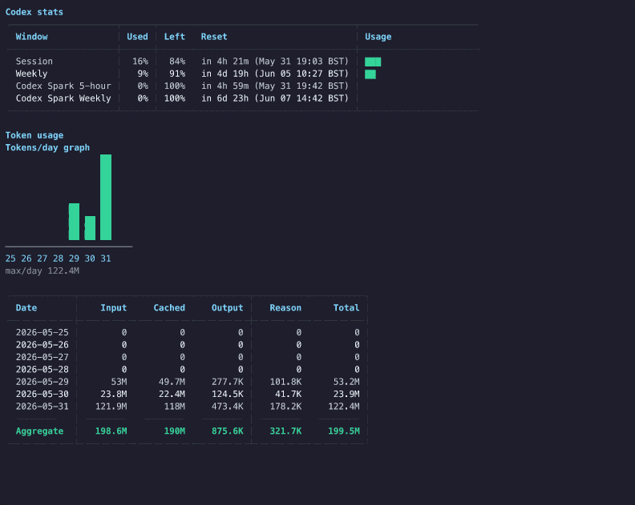

# codexstat

Terminal stats for Codex usage, limits, and local token history.

```sh
curl -fsSL https://raw.githubusercontent.com/cpluss/codexstat/main/install.sh | sh
```

`codexstat` is a small local CLI that shows your current Codex session and weekly limits, account/credit metadata, and recent token usage from local Codex session logs. It is built for people who want a fast terminal readout without a menu bar app or browser dashboard scraping.

<p align="center">
  
</p>

## What It Shows

- Current Codex session, weekly, and model-specific limits.
- Account, plan, credit, source, and scan metadata.
- Token usage by day from local Codex JSONL session logs.
- Quota history graphs from local `codexstat` snapshots.
- Text tables and charts for humans; JSON output for scripts.

## Install

Install the latest release:

```sh
curl -fsSL https://raw.githubusercontent.com/cpluss/codexstat/main/install.sh | sh
```

The installer downloads a prebuilt release for macOS or Linux and installs `codexstat` to `~/.local/bin`. If no matching release binary is available, it falls back to `go install`.

Prefer to inspect the installer first?

```sh
curl -fsSLO https://raw.githubusercontent.com/cpluss/codexstat/main/install.sh
less install.sh
sh install.sh
```

If `codexstat` is not found after install, add the default install directory to your shell:

```sh
export PATH="$HOME/.local/bin:$PATH"
```

Install to another directory:

```sh
curl -fsSL https://raw.githubusercontent.com/cpluss/codexstat/main/install.sh | CODEXSTAT_INSTALL_DIR="$HOME/bin" sh
```

Install a specific version:

```sh
curl -fsSL https://raw.githubusercontent.com/cpluss/codexstat/main/install.sh | CODEXSTAT_VERSION=v0.4.3 sh
```

Install from source with Go:

```sh
GOBIN="$HOME/.local/bin" go install github.com/cpluss/codexstat/cmd/codexstat@latest
```

Install the current checkout:

```sh
./install.sh --local
```

## Update

Re-run the installer:

```sh
curl -fsSL https://raw.githubusercontent.com/cpluss/codexstat/main/install.sh | sh
```

If you installed with Go:

```sh
GOBIN="$HOME/.local/bin" go install github.com/cpluss/codexstat/cmd/codexstat@latest
```

If you installed from a checkout:

```sh
git pull --ff-only && ./install.sh --local
```

Track unreleased `main` instead of tagged releases:

```sh
curl -fsSL https://raw.githubusercontent.com/cpluss/codexstat/main/install.sh | CODEXSTAT_VERSION=main sh
```

## Requirements

- macOS or Linux.
- A working Codex CLI login for live limit data.
- `curl` and `tar` for the shell installer.
- Go 1.26 or newer only for source installs or installer fallback builds.

## Quick Start

```sh
codexstat
codexstat tokens --days 30
codexstat history --metric session
codexstat --json --pretty
```

By default, `codexstat` uses `--source auto`: it tries OAuth usage data first, then falls back to a local `codex app-server` process.

## Commands

### `codexstat`

Print current Codex account, credit, rate-limit, and recent token usage stats.

Common flags:

| Flag | Description |
| --- | --- |
| `--source auto|oauth|cli` | Choose the live stats source. Default: `auto`. |
| `--json` | Print machine-readable JSON. |
| `--pretty` | Pretty-print JSON output. |
| `--codex-home PATH` | Use a Codex home other than `~/.codex`. |
| `--codex-bin PATH` | Use a specific Codex executable for CLI fallback. |
| `--timeout DURATION` | Set the live stats fetch timeout. Default: `15s`. |
| `--no-refresh` | Do not refresh stale OAuth tokens. |
| `--no-record` | Do not append this live fetch to quota history. |
| `--history-file PATH` | Store quota snapshots somewhere other than the default path. |
| `--no-color` | Disable ANSI color. `NO_COLOR` is also respected. |
| `--version` | Print the installed version and exit. |

### `codexstat tokens`

Shortcut for local token usage history:

```sh
codexstat tokens --days 30
```

This is equivalent to:

```sh
codexstat history --metric tokens --days 30
```

### `codexstat history`

Print a graph from local history:

```sh
codexstat history --days 14
codexstat history --metric input
codexstat history --metric cached
codexstat history --metric output
codexstat history --metric reasoning
codexstat history --metric session
codexstat history --metric weekly
```

History flags:

| Flag | Description |
| --- | --- |
| `--days N` | Number of days to show. Default: `7`. |
| `--metric tokens|input|cached|output|reasoning|session|weekly` | Select the graph metric. Default: `tokens`. |
| `--codex-home PATH` | Use a Codex home other than `~/.codex` for token logs. |
| `--history-file PATH` | Read quota snapshots from a custom path. |
| `--json` | Print machine-readable JSON. |
| `--pretty` | Pretty-print JSON output. |
| `--no-color` | Disable ANSI color. |

## Data Sources

`codexstat` can read live stats in two ways.

`--source oauth` reads local Codex OAuth credentials from:

- `~/.codex/auth.json`
- `$CODEX_HOME/auth.json`
- the path implied by `--codex-home`

It calls the Codex usage endpoint with the local access token. If the credential file contains a stale refresh token and `--no-refresh` is not set, `codexstat` refreshes the token and writes the updated credentials back to the same Codex auth file.

`--source cli` starts:

```sh
codex -s read-only -a untrusted app-server
```

Then it reads account and rate-limit data over the local JSON-RPC app-server protocol.

`--source auto` tries OAuth first and falls back to the CLI source if OAuth fails before the overall timeout.

## Local History

Token usage is scanned from local Codex session logs:

- `~/.codex/sessions/YYYY/MM/DD/*.jsonl`
- `~/.codex/archived_sessions/*.jsonl`

Quota snapshots are recorded after successful live stats fetches unless `--no-record` is passed. Those snapshots power:

- `codexstat history --metric session`
- `codexstat history --metric weekly`

Default quota snapshot paths:

- macOS: `~/Library/Application Support/codexstat/history.jsonl`
- Linux and other Unix: `$XDG_STATE_HOME/codexstat/history.jsonl` or `~/.local/state/codexstat/history.jsonl`

Set `CODEXSTAT_HISTORY` or pass `--history-file` to use a different file.

## JSON Output

Use JSON for scripts, dashboards, or snapshot diffs:

```sh
codexstat --json --pretty
codexstat history --metric tokens --json --pretty
codexstat history --metric weekly --json --pretty
```

The main JSON output includes fetched live data and the local token usage report under `token_usage`.

## Privacy

`codexstat` runs locally and does not run a background service.

It reads:

- local Codex auth and config files;
- local Codex session JSONL logs;
- the local `codex app-server` when using the CLI source.

It writes:

- quota snapshots to the `codexstat` history JSONL file;
- refreshed Codex OAuth credentials, only when refresh is needed and `--no-refresh` is not set.

For live OAuth stats, it sends requests to the Codex/ChatGPT usage endpoint and to `auth.openai.com` only when a token refresh is needed. Use `--no-record` to disable quota snapshot writes for a run.

## Development

Clone the repo and run the tests:

```sh
git clone https://github.com/cpluss/codexstat.git
cd codexstat
go test ./...
```

Build and run locally:

```sh
go build -o ./codexstat ./cmd/codexstat
./codexstat --version
./codexstat
```

Install the checkout:

```sh
./install.sh --local
```

`codexstat --version` is derived from Go build metadata. Tagged public installs report the selected tag; local checkout and branch installs may report a pseudo-version or `dev` with VCS details.

## Contributing

Issues and pull requests are welcome.

Before opening a PR:

- run `go test ./...`;
- keep changes focused;
- update the README when behavior, flags, install paths, or data sources change;
- avoid committing real Codex auth files, session logs, or private usage output.

If you change terminal rendering, regenerate or update the demo image only when the visible output actually changes.

## Maintainer Notes

The release workflow is tag-driven. To publish a release:

```sh
go test ./...
git tag v0.4.3
git push origin v0.4.3
```

Pushing a `v*` tag runs `.github/workflows/release.yml`, builds macOS and Linux tarballs, publishes `checksums.txt`, and creates or updates the GitHub release.

After the release is published, verify the installer from outside the checkout:

```sh
tmp="$(mktemp -d)"
curl -fsSL https://raw.githubusercontent.com/cpluss/codexstat/main/install.sh | CODEXSTAT_INSTALL_DIR="$tmp" sh
"$tmp/codexstat" --version
```

The public Go install fallback depends on the module path in `go.mod`:

```txt
github.com/cpluss/codexstat
```

## Troubleshooting

`codexstat: Codex auth.json not found`

Run `codex` once and log in, or pass `--source cli` if you want to force the local CLI app-server path.

`codexstat: Codex CLI not found on PATH`

Install the Codex CLI or pass `--codex-bin /path/to/codex`.

`codexstat` installed but the shell cannot find it

Add the install directory to `PATH`:

```sh
export PATH="$HOME/.local/bin:$PATH"
```

No token history appears

Run Codex normally first so local session JSONL logs exist, then run `codexstat tokens`.

## License

No license file has been committed yet. Add one before treating this repository as reusable open-source software.
